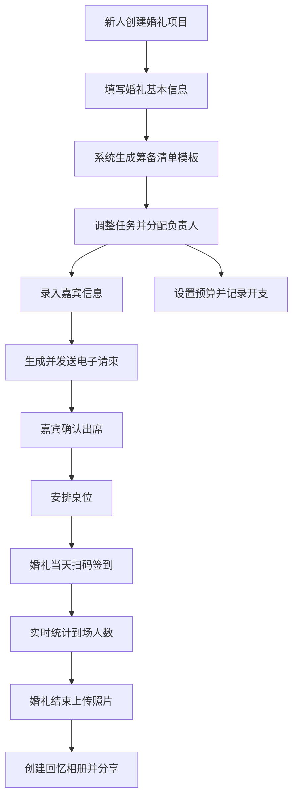

## 1. 产品概述

数字婚礼策划管理系统是一款面向准新人的一站式婚礼筹备管理平台。系统覆盖从项目创建、任务清单、嘉宾管理、预算控制到现场签到和回忆相册的全流程，帮助用户高效有序地完成婚礼筹备工作。

- 目标用户：即将举办婚礼的新人及其家庭成员
- 核心价值：简化婚礼筹备复杂度，提升协作效率，可视化管理进度

## 2. 核心功能

### 2.1 用户角色

| 角色 | 使用方式 | 核心权限 |
|------|----------|----------|
| 新人（主用户） | 直接注册使用 | 所有功能的完整访问权，项目创建与管理 |
| 新人父母 | 被分配任务 | 查看分配的任务，更新任务状态 |
| 受邀嘉宾 | 收到请柬链接 | 查看请柬信息，确认/拒绝出席，查看相册 |

### 2.2 功能模块

1. **首页仪表盘**：婚礼倒计时、即将到期任务高亮、项目概览统计
2. **婚礼项目管理**：创建/编辑婚礼项目，设置婚礼日期、地点、新人信息
3. **筹备清单模块**：预置任务模板，增删任务项，分配负责人，状态跟踪
4. **嘉宾管理模块**：嘉宾信息录入，电子请柬生成，短信/邮件发送，出席确认
5. **桌位安排模块**：可视化表格布局，拖拽分配嘉宾座位
6. **预算管理模块**：分类开支记录，预算vs实际对比，超支预警
7. **签到模块**：扫码签到，实时到场人数统计
8. **回忆相册模块**：照片上传，相册创建，嘉宾分享访问

### 2.3 页面详情

| 页面名称 | 模块名称 | 功能描述 |
|-----------|-------------|---------------------|
| 首页仪表盘 | 倒计时卡片 | 展示距婚礼天数、小时、分钟的动态倒计时 |
| 首页仪表盘 | 紧急待办列表 | 高亮显示7天内即将到期的未完成任务 |
| 首页仪表盘 | 数据概览 | 嘉宾总数、预算使用率、任务完成率等统计卡片 |
| 婚礼项目 | 项目表单 | 录入新人姓名、婚礼日期、场地、主题风格 |
| 筹备清单 | 任务分类面板 | 场地/婚纱/宴会等分类，可展开收起 |
| 筹备清单 | 任务卡片 | 任务名称、截止日期、负责人、状态标签 |
| 筹备清单 | 任务编辑弹窗 | 新增/编辑任务，分配新人/父母角色 |
| 嘉宾管理 | 嘉宾列表 | 表格展示所有嘉宾，支持搜索筛选 |
| 嘉宾管理 | 嘉宾表单 | 录入姓名、电话、邮箱、关系、桌位偏好 |
| 嘉宾管理 | 请柬生成器 | 选择模板样式，个性化文字，生成电子请柬 |
| 桌位安排 | 可视化布局 | 圆桌/方桌可选，拖拽嘉宾入座 |
| 预算管理 | 分类汇总表 | 各大类预算金额、实际花费、差额 |
| 预算管理 | 开支明细 | 记录每笔支出，支持编辑删除 |
| 预算管理 | 超支预警 | 红色标记超支分类，进度条可视化 |
| 签到模块 | 扫码界面 | 生成签到二维码，手动录入模式 |
| 签到模块 | 实时统计 | 已到/未到/总人数，嘉宾到场列表 |
| 回忆相册 | 相册网格 | 瀑布流展示照片，支持放大浏览 |
| 回忆相册 | 上传面板 | 多图批量上传，相册分类管理 |

## 3. 核心流程

## 4. 用户界面设计

### 4.1 设计风格

- **主色调**：浪漫玫瑰粉 (#E8B4B8) + 优雅香槟金 (#D4AF89)
- **辅助色**：奶油白 (#FFF5EE) + 深酒红 (#8B2635)
- **按钮风格**：圆角胶囊型，微渐变背景，hover时微上浮
- **字体**：标题使用 "Playfair Display" 衬线体营造优雅感，正文使用 "Noto Sans SC"
- **布局风格**：卡片式布局，精致边框阴影，柔和圆角
- **图标风格**：Lucide线性图标，细线条优雅风格

### 4.2 页面设计概要

| 页面名称 | 模块名称 | UI元素 |
|-----------|-------------|-------------|
| 首页仪表盘 | 倒计时 | 大数字展示，玫瑰粉渐变背景，心跳动画 |
| 首页仪表盘 | 紧急待办 | 左侧红色渐变竖条标识，倒计时徽章 |
| 筹备清单 | 任务卡片 | 香槟金边框，分类图标，状态标签胶囊 |
| 嘉宾管理 | 嘉宾列表 | 头像圆形，出席状态色点标记，操作按钮组 |
| 桌位安排 | 桌位布局 | 圆形桌子代表，嘉宾头像环绕，拖拽高亮 |
| 预算管理 | 进度条 | 渐变填充，超支部分红色溢出指示 |
| 签到模块 | 二维码 | 大尺寸居中，香槟金边框装饰 |
| 回忆相册 | 照片网格 | 圆角卡片，hover放大，淡入加载动画 |

### 4.3 响应式设计

- 桌面端优先（1280px+），侧边导航固定
- 平板端（768-1280px）：导航折叠为侧边抽屉
- 移动端（<768px）：底部Tab导航，卡片单列布局
- 所有触摸区域最小44x44px，支持手势滑动切换模块
