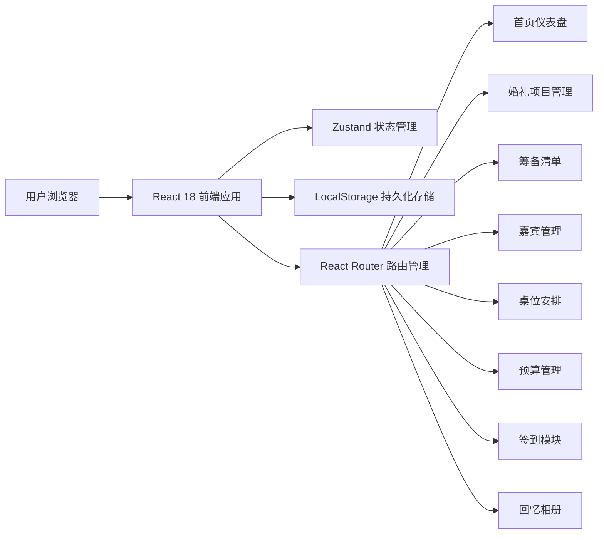
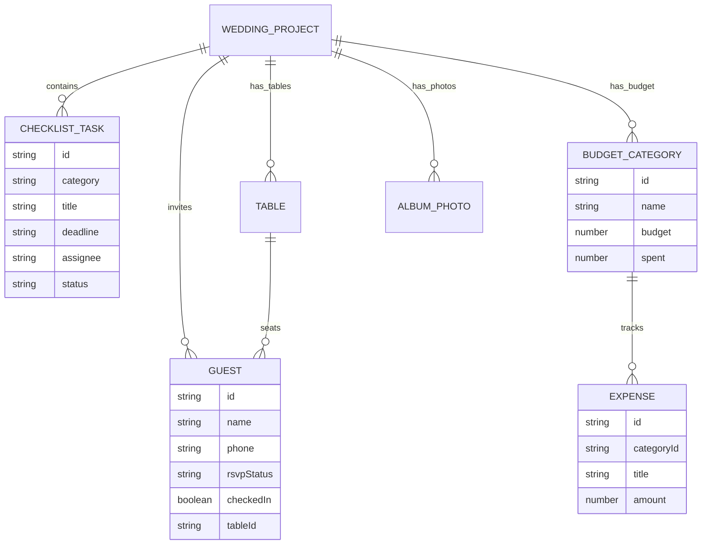

## 1. 架构设计



## 2. 技术描述

- **前端框架**：React 18 + TypeScript
- **构建工具**：Vite 6
- **路由管理**：React Router DOM 6
- **状态管理**：Zustand
- **样式方案**：Tailwind CSS 3
- **图标库**：Lucide React
- **数据持久化**：LocalStorage（模拟数据，无后端依赖）
- **二维码生成**：基于Canvas的QR Code生成方案
- **初始化模板**：react-ts

## 3. 路由定义

| 路由路径 | 页面用途 |
|----------|----------|
| / | 首页仪表盘（倒计时+紧急待办+数据概览） |
| /project | 婚礼项目创建与编辑 |
| /checklist | 筹备清单管理 |
| /guests | 嘉宾信息管理 |
| /invitations | 电子请柬生成与发送 |
| /seating | 桌位安排可视化 |
| /budget | 预算管理与开支记录 |
| /checkin | 签到功能模块 |
| /album | 回忆相册 |

## 4. 数据模型（Zustand Store）

### 4.1 数据结构定义

```typescript
interface WeddingProject {
  id: string;
  groomName: string;
  brideName: string;
  weddingDate: string;
  weddingTime: string;
  venue: string;
  address: string;
  theme: string;
  coverImage?: string;
  createdAt: string;
}

interface ChecklistTask {
  id: string;
  category: 'venue' | 'dress' | 'catering' | 'photo' | 'ceremony' | 'other';
  title: string;
  description?: string;
  deadline: string;
  assignee: 'groom' | 'bride' | 'groom_father' | 'groom_mother' | 'bride_father' | 'bride_mother';
  status: 'pending' | 'in_progress' | 'completed';
  priority: 'low' | 'medium' | 'high';
}

interface Guest {
  id: string;
  name: string;
  phone: string;
  email?: string;
  relation: 'groom_side' | 'bride_side';
  group?: string;
  seatPreference?: string;
  rsvpStatus: 'pending' | 'confirmed' | 'declined';
  confirmedAt?: string;
  checkedIn: boolean;
  checkedInAt?: string;
  plusOne?: boolean;
  plusOneName?: string;
  notes?: string;
  tableId?: string;
  seatNumber?: number;
}

interface Table {
  id: string;
  name: string;
  type: 'round' | 'square';
  capacity: number;
  shape?: string;
}

interface BudgetCategory {
  id: string;
  name: string;
  icon: string;
  budget: number;
  spent: number;
}

interface Expense {
  id: string;
  categoryId: string;
  title: string;
  amount: number;
  date: string;
  notes?: string;
  payee?: string;
}

interface AlbumPhoto {
  id: string;
  url: string;
  caption?: string;
  uploadedAt: string;
  category?: string;
}
```

### 4.2 实体关系图



## 5. Store 结构设计

```
store/
  ├── index.ts          # 主Store入口，组合所有子store
  ├── projectStore.ts   # 婚礼项目状态管理
  ├── checklistStore.ts # 筹备清单状态管理
  ├── guestStore.ts     # 嘉宾管理状态管理
  ├── seatingStore.ts   # 桌位安排状态管理
  ├── budgetStore.ts    # 预算管理状态管理
  ├── checkinStore.ts   # 签到功能状态管理
  └── albumStore.ts     # 回忆相册状态管理
```

## 6. 组件目录结构

```
src/
  ├── components/
  │   ├── layout/          # 布局组件（Sidebar, Header, Layout）
  │   ├── common/          # 通用组件（Button, Modal, Card, Badge）
  │   ├── dashboard/       # 仪表盘组件
  │   ├── checklist/       # 清单模块组件
  │   ├── guests/          # 嘉宾模块组件
  │   ├── seating/         # 桌位模块组件
  │   ├── budget/          # 预算模块组件
  │   ├── checkin/         # 签到模块组件
  │   └── album/           # 相册模块组件
  ├── pages/               # 页面级组件
  ├── store/               # Zustand状态管理
  ├── types/               # TypeScript类型定义
  ├── utils/               # 工具函数
  ├── hooks/               # 自定义Hooks
  ├── data/                # 初始Mock数据和模板
  ├── App.tsx
  ├── main.tsx
  └── index.css
```
